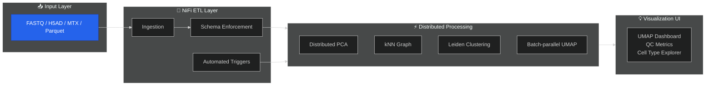
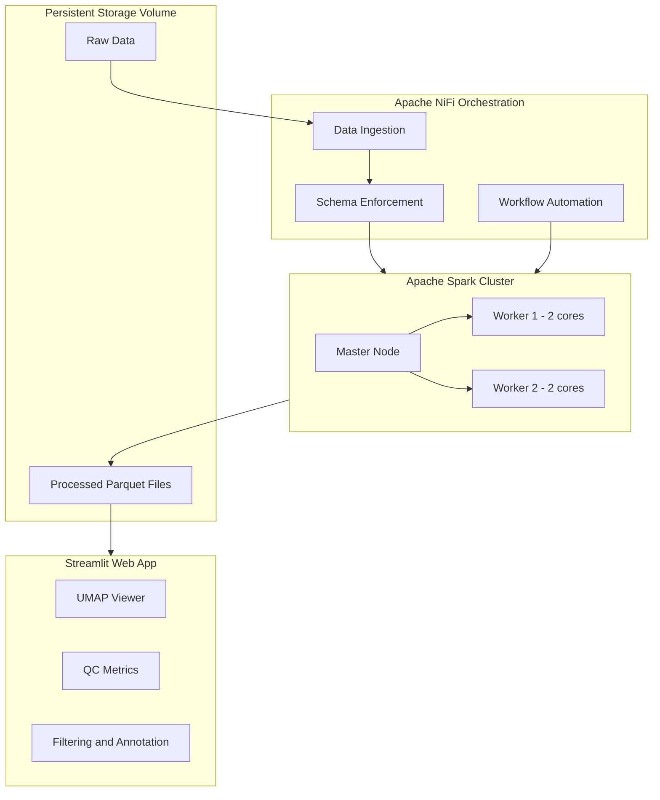
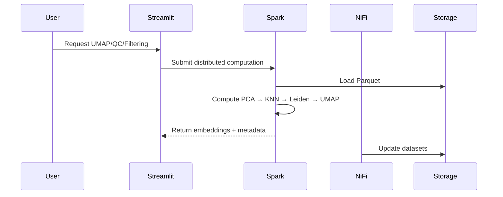

# <p align="center">⚡ Scalable Single-Cell RNA-Seq Analysis Platform</p>

<p align="center">
  
</p>

<p align="center">
  <a href="https://doi.org/10.5281/zenodo.17611614">
    
  </a>
  
  
  
  
  
</p>

---

# 📋 Table of Contents

* [Overview](#overview)
* [Key Features](#key-features)
* [System Architecture](#system-architecture)
* [Data Flow](#data-flow)
* [Quick Start](#quick-start)
* [Technology Stack](#technology-stack)
* [Project Structure](#project-structure)
* [Methods](#methods)
* [Usage Examples](#usage-examples)
* [Troubleshooting](#troubleshooting)
* [Performance](#performance)
* [API Reference](#api-reference)
* [Development](#development)
* [Contributing](#contributing)
* [Citation](#citation)
* [Author](#author)
* [License](#license)

---

# 🔬 Overview

The **Scalable Single-Cell RNA-Seq Analysis Platform** is a production-grade, containerized system designed for **distributed single-cell transcriptomics**, integrating:

* **Apache Spark** → scalable computation for 50K–1M+ cells
* **Streamlit** → interactive QC dashboards & UMAP visualization
* **Apache NiFi** → automated ETL & workflow triggers
* **Docker Compose** → reproducible, multi-service deployment

This platform enables **end-to-end single-cell analysis**, from raw gene-count matrices to interactive biological exploration.

---

# 🧬 High-Level Diagram



---

# ✨ Key Features

### 🚀 Distributed Computation

* Apache **Spark 3.5.0**
* Highly parallel QC, PCA, KNN, Leiden, UMAP
* Optimized for **100K–1M cells**

### 📊 Real-Time Visualization

* Interactive **UMAP** (Plotly)
* QC Metrics:

  * mitochondrial %
  * total counts
  * gene counts
* Dynamic filtering and cell type annotations

### 🔁 Workflow Orchestration

* **NiFi** ETL pipelines
* Automatic ingestion & schema validation
* Event-driven triggers

### 🐳 Containerized Deployment

* Docker Compose
* Consistent environments
* Reproducible analysis

---

# 🏗️ System Architecture

## **Full System Architecture Diagram**



---

# 🔁 Data Flow



---

# ⚡ Quick Start

### **Prerequisites**

* Docker Engine 20+
* Docker Compose 2+
* 8GB RAM (16GB recommended)

### **Deploy the platform**

```bash
git clone https://github.com/mtariqi/scalable-single-cell-platform
cd scalable-single-cell-platform

./start_single_cell_platform.sh
./verify_platform.sh
```

### **Access Services**

| Service      | URL                                            | Status |
| ------------ | ---------------------------------------------- | ------ |
| Streamlit UI | [http://localhost:8501](http://localhost:8501) | ✅ Live |
| Spark Master | [http://localhost:8081](http://localhost:8081) | ✅ Live |
| Apache NiFi  | [http://localhost:8080](http://localhost:8080) | ✅ Live |

---

# 🧪 Methods

### **1. Data Ingestion**

* Accepts H5AD, MTX, Parquet, Cell Ranger outputs
* NiFi automates ingest → schema validation → handoff to Spark

### **2. Preprocessing**

* QC thresholds
* Library size normalization
* Highly-variable genes (HVG)
* Optional batch correction

### **3. Distributed Analytics (Spark MLlib)**

* Truncated SVD PCA
* Partitioned cosine similarity KNN
* Leiden/Louvain clustering
* UMAP (batch parallel mode)

### **4. Visualization**

* Streamlit + Plotly
* Interactive QC
* UMAP embedding viewer
* Cell type exploration

### **5. Reproducibility**

* Dockerized full stack
* Deterministic Spark configs
* Version-locked environment
* Zenodo DOI: **10.5281/zenodo.17611614**

---

# 📁 Project Structure

```
scalable-single-cell-platform/
├── docker-compose.yml
├── start_single_cell_platform.sh
├── verify_platform.sh
├── web_app/
│   ├── app.py
│   ├── Dockerfile
│   └── download_data_simple.py
├── pipelines/
│   └── spark_jobs/
│       ├── csv_data_processor.py
│       └── real_data_processor.py
├── data/
│   └── processed/cell_metadata.parquet
├── docs/
│   ├── images/
│   │   ├── banner.svg
│   │   └── architecture.png
│   └── REPORT.md
└── scripts/
```

---

# 📘 Usage Examples

## **Distributed QC**

```python
spark = SparkSession.builder.master("spark://spark-master:7077").getOrCreate()
df = spark.read.parquet("/data/processed/cell_metadata.parquet")
df.describe().show()
```

## **UMAP Plot (Streamlit)**

```python
fig = px.scatter(
    df.toPandas(), x="umap_1", y="umap_2", color="cell_type"
)
st.plotly_chart(fig)
```

---

# 🔧 Troubleshooting (Most Common Issues)

### **Port conflicts**

```
netstat -tulpn | grep -E '8501|8080|8081'
```

### **Spark worker not connecting**

```
docker logs sc_spark_worker
```

### **Data loading errors**

```
python scripts/fix_data_columns.py
```

---

# 📈 Performance Benchmarks

| Dataset Size  | Runtime   | RAM      | CPU Usage |
| ------------- | --------- | -------- | --------- |
| 5,000 cells   | 2–3 min   | 2–3 GB   | 45–60%    |
| 50,000 cells  | 8–12 min  | 6–8 GB   | 75–90%    |
| 100,000 cells | 15–25 min | 12–16 GB | 90%+      |

---

# 🔌 API Reference

### `load_metadata()`

Load Parquet into Pandas/Spark.

### `create_umap_plot(color_by)`

Generate interactive UMAP.

### `calculate_qc(df)`

Distributed QC metrics.

### `real_data_processor.py`

H5AD/LOOM → Parquet converter.

---

# 🤝 Contributing

```bash
git checkout -b feature/new-component
git commit -m "Add new module"
git push origin feature/new-component
```

Contributions welcome in:

* Spark jobs
* NiFi workflows
* Visualization modules
* Documentation

---

# 📖 Citation

### **APA 7**

Islam, M. T. (2025). *Scalable Single-Cell RNA-Seq Analysis Platform (1.0.0)* [Computer software]. Zenodo. [https://doi.org/10.5281/zenodo.17611614](https://doi.org/10.5281/zenodo.17611614)

### **BibTeX**

```bibtex
@software{islam_scalable_single_cell_2025,
  author    = {Islam, Md Tariqul},
  title     = {Scalable Single-Cell RNA-Seq Analysis Platform},
  version   = {1.0.0},
  year      = {2025},
  publisher = {Zenodo},
  doi       = {10.5281/zenodo.17611614},
  url       = {https://doi.org/10.5281/zenodo.17611614}
}
```

---

# 👤 Author

**MD Tariqul Islam (Tariq)**
📧 Email: **[tariqul@scired.com](mailto:tariqul@scired.com)**
🌐 LinkedIn: [https://www.linkedin.com/in/mdtariqulscired](https://www.linkedin.com/in/mdtariqulscired)
💻 GitHub: [https://github.com/mtariqi](https://github.com/mtariqi)

---

# 🧾 License

This project is released under the **MIT License**.

---

